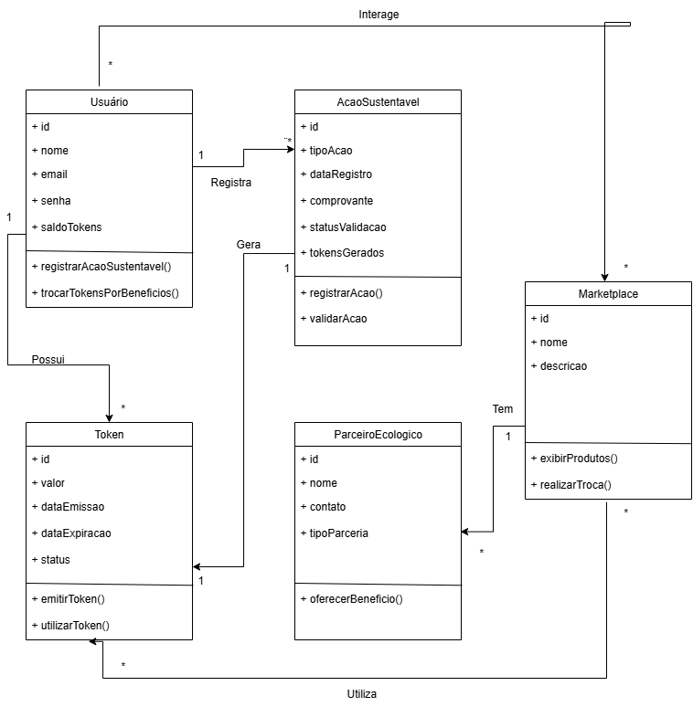

# Diagrama de Classes

## Introdução
O Diagrama de Classes é uma representação estática do sistema SustentabilizeJá, descrevendo suas entidades principais, atributos, métodos e relacionamentos.  
Ele oferece uma visão estrutural do domínio do problema, facilitando a compreensão de como os objetos se relacionam e colaboram para atender às funcionalidades do sistema, como registro de ações sustentáveis, geração de tokens e interação com parceiros no marketplace.

Esse tipo de diagrama é fundamental para alinhar a modelagem de dados e comportamentos, além de servir como base para a implementação e documentação técnica da solução.

---

## Metodologia
A elaboração do diagrama seguiu as seguintes etapas:

1. **Análise de Requisitos**: Foram levantadas as entidades e regras de negócio principais do projeto, como cadastro de usuário, ações sustentáveis, emissão e uso de tokens, e troca de benefícios.
2. **Identificação das Classes**: Com base nos requisitos, foram definidas as classes centrais (Usuário, Ação Sustentável, Token, Marketplace e Parceiro Ecológico), bem como seus atributos e métodos essenciais.
3. **Definição dos Relacionamentos**: As interações entre as classes foram modeladas, representando cardinalidades e dependências lógicas.
4. **Modelagem Visual**: O diagrama foi construído utilizando notação UML, evidenciando atributos (+) e operações (+), além de relacionamentos entre as entidades.

---

## Diagrama e Descrição das Classes

**Figura 1. Diagrama de Classes do SustentabilizeJá**

<b>Figura 1.</b>  Diagrama de Classes do SustentabilizeJá 

<b>Autor:</b> [Renan Pariz](https://github.com/renanpariiz), [André Lopes](https://github.com/AndreLopesDeSousa), [Henrique Carvalho](https://github.com/henriquecarv3) e [Kaio Macedo](https://github.com/bigkaio) 

### 📌 Classes Principais

- **Usuário**  
  Representa os participantes da plataforma. Possui informações pessoais e o saldo de tokens.  
  - Métodos: registrar ações sustentáveis e trocar tokens por benefícios.  
  - Relacionamentos: registra ações sustentáveis, possui tokens e interage com o marketplace.

- **Ação Sustentável**  
  Representa atividades registradas pelos usuários (ex.: reciclagem, plantio, economia de energia).  
  - Atributos: tipo de ação, comprovante, status de validação, data de registro.  
  - Métodos: registrar e validar ações.  
  - Relacionamentos: gera tokens e pertence a um usuário.

- **Token**  
  Unidade de valor emitida como recompensa por ações sustentáveis.  
  - Atributos: valor, data de emissão, data de expiração e status.  
  - Métodos: emitir e utilizar token.  
  - Relacionamentos: gerado por ações sustentáveis, pertence a um usuário e pode ser utilizado no marketplace.

- **Marketplace**  
  Ambiente onde tokens podem ser trocados por benefícios.  
  - Métodos: exibir produtos e realizar trocas.  
  - Relacionamentos: interage com usuários, utiliza tokens e possui parceiros ecológicos.

- **Parceiro Ecológico**  
  Organizações que oferecem benefícios em troca de tokens.  
  - Atributos: nome, contato e tipo de parceria.  
  - Métodos: oferecer benefícios.  
  - Relacionamentos: vinculados ao marketplace.

---

## Conclusão
O diagrama de classes do SustentabilizeJá foi essencial para organizar a estrutura lógica do sistema.  
Ele demonstra como as entidades centrais se relacionam, reforçando o ciclo completo: **usuário registra ações → ações geram tokens → tokens são utilizados no marketplace com parceiros ecológicos**.  

Esse modelo fornece a base conceitual para a implementação, garantindo clareza nas responsabilidades de cada classe e escalabilidade futura.

---

## Referências
[1] Lucidchart. UML Class Diagram Tutorial. Disponível em: https://www.lucidchart.com/pages/uml-class-diagram. Acesso em: 19 de setembro de 2025.  
[2] Creately. Diagrama de Classes UML. Disponível em: https://creately.com/diagram-type/class-diagram/. Acesso em: 19 de setembro de 2025.  
[3] IBM. UML Class Diagrams Overview. Disponível em: https://www.ibm.com/docs/en/rational-soft-arch/9.6.1?topic=diagrams-class-uml. Acesso em: 19 de setembro de 2025.  

---

## Histórico de Versões

| Versão | Descrição                            | Autor(es)                                                                                         | Data       | Revisor(es)                                                                                                 | Data de Revisão |
| ------ | ------------------------------------ | ------------------------------------------------------------------------------------------------- | ---------- | ----------------------------------------------------------------------------------------------------------- | --------- |
| 1.0    | Criação do Diagrama de Comunicação | [Henrique Carvalho](https://github.com/henriquecarv3), [Kaio Macedo](https://github.com/bigkaio), [Renan Batista](https://github.com/renanpariiz) e [André Lopes](https://github.com/AndreLopesDeSousa) | 21/09/2025 |  |  |
