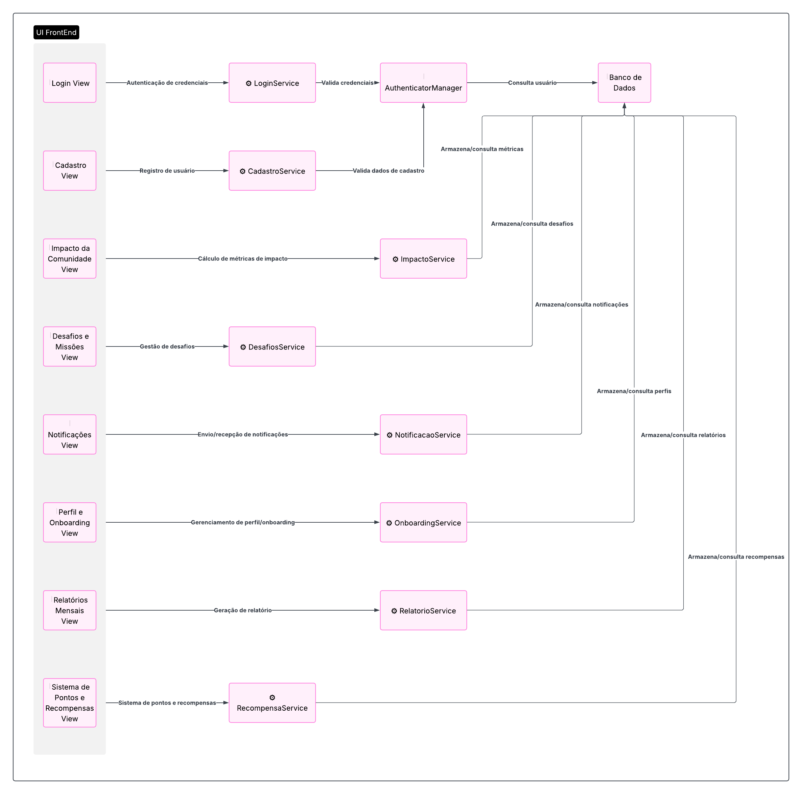

### **Diagrama de Componentes**

#### **Introdução**

O Diagrama de Componentes é uma representação visual da arquitetura do sistema **SustentabilidadeJá**, que descreve os módulos de software, suas interfaces e as dependências entre eles. Ele oferece uma visão estruturada da aplicação, ajudando a compreender como as diferentes partes interagem para entregar as funcionalidades propostas, desde a autenticação de um usuário até o gerenciamento de recompensas.

A modelagem desses componentes é fundamental para definir responsabilidades, identificar módulos reutilizáveis e facilitar a comunicação técnica entre a equipe de desenvolvimento, garantindo uma base sólida para a construção e manutenção da plataforma.

#### **Metodologia**

Para a elaboração do diagrama, a equipe seguiu um processo estruturado:

1.  **Análise dos Requisitos:** Foi realizada uma revisão das funcionalidades do projeto (onboarding, missões, relatórios, etc.) para identificar os principais módulos de software e suas responsabilidades lógicas.
2.  **Definição da Arquitetura:** Com base nos requisitos, foi definida uma arquitetura em camadas, separando as responsabilidades de interface do usuário (Views), lógica de negócio (Services) e persistência de dados (Banco de Dados).
3.  **Desenho e Refinamento:** Utilizando a ferramenta Lucidchart, o diagrama foi desenhado para detalhar as interações e dependências entre cada `View` e seu respectivo `Service`, bem como a comunicação com componentes centrais como o `AuthenticatorManager` e o `Banco de Dados`.

#### **Diagrama e Descrição dos Componentes**

A seguir, a figura com o diagrama de componentes elaborado para o projeto.

<b>Figura 1.</b>  Diagrama de Componentes do SustentabilidadeJa 

<b>Autor:</b>  [Gustavo Gontijo](https://https://github.com/Guga301104), [Ana Luiza Komatsu](https://github.com/luluaroeira) e [Davi Oliveira](https://https://github.com/daviRolvr) 

**Descrição:** O Diagrama de Componentes (Figura 1) ilustra a arquitetura lógica da aplicação **SustentabilidadeJá**, organizada em camadas claras de responsabilidade:

* **UI FrontEnd (Views):** Esta camada agrupa todos os componentes de interface que interagem diretamente com o usuário. Cada `View` é responsável por uma funcionalidade específica, como `Login View`, `Cadastro View`, `Impacto da Comunidade View`, `Desafios e Missões View`, `Notificações View`, `Perfil e Onboarding View`, `Relatórios Mensais View` e `Sistema de Pontos e Recompensas View`.

* **Camada de Serviços (Services):** Representa o núcleo da lógica de negócio. Para cada `View`, há um `Service` correspondente (`LoginService`, `CadastroService`, `ImpactoService`, etc.) que processa as requisições, aplica as regras de negócio e coordena a comunicação com a camada de dados.

* **AuthenticatorManager:** É um componente centralizado que gerencia a autenticação e autorização. Ele interage com o `LoginService` e o `CadastroService` para validar credenciais e consultar os dados do usuário no banco de dados, garantindo a segurança do acesso.

* **Banco de Dados:** Este componente central representa a camada de persistência de dados. Ele é o repositório único de informações, acessado por todos os `Services` e pelo `AuthenticatorManager` para consultar e armazenar dados sobre usuários, métricas, desafios, notificações, perfis, relatórios e recompensas.

O fluxo de interação geralmente começa em uma `View` na **UI FrontEnd**, que envia uma requisição para o `Service` correspondente. O `Service` processa a lógica e, quando necessário, interage com o **Banco de Dados** (ou com o **AuthenticatorManager** para fins de login/cadastro) para completar a operação.

# Análise Crítica

O diagrama de componentes desenvolvido para o **SustentabilidadeJá** cumpriu um papel essencial na definição da arquitetura lógica do sistema. Ele nos permitiu visualizar, de forma estruturada, a separação das responsabilidades e como os módulos se relacionam para entregar as funcionalidades planejadas.  

## Pontos Relevantes
- A **organização em camadas** (Views, Services, AuthenticatorManager e Banco de Dados) trouxe clareza à arquitetura, facilitando tanto a compreensão quanto a comunicação entre os membros da equipe.  
- A associação direta entre cada `View` e seu respectivo `Service` mostrou-se uma decisão importante para manter a coesão e a rastreabilidade entre interface e regras de negócio.  
- A inclusão de um componente central de autenticação (`AuthenticatorManager`) reforçou a preocupação com **segurança e controle de acesso**, aspecto fundamental em sistemas que envolvem cadastros e recompensas.  
- A modelagem favorece **escalabilidade e manutenção**, uma vez que novos módulos podem ser adicionados sem comprometer a estrutura geral.  

## Possibilidades de Evolução
- A arquitetura foi representada em um nível de **abstração adequado para este estágio do projeto**, priorizando a clareza conceitual. Em fases posteriores, poderá ser enriquecida com **interfaces explícitas** entre os componentes, destacando os contratos de comunicação e dependências.  
- O componente de **Banco de Dados** foi tratado de forma única e centralizada, o que cumpre bem o papel nesta versão inicial. Contudo, em cenários futuros, pode ser interessante detalhar **subcomponentes** (ex.: módulos de relatórios, notificações, gamificação) para apoiar uma visão mais granular da persistência.  
- As interações entre os serviços e o `AuthenticatorManager` foram bem destacadas, mas podem ser expandidas para contemplar **cenários de integração externa**, como APIs de parceiros ecológicos ou gateways de pagamento.  

### **Conclusão**

A construção deste diagrama de componentes foi essencial para a equipe, pois permitiu detalhar a arquitetura lógica e o fluxo de dados do **SustentabilidadeJá**. A clara separação de responsabilidades entre as camadas de visualização (`Views`), lógica de negócio (`Services`) e persistência (`Banco de Dados`) não só facilita o desenvolvimento paralelo, mas também promove a manutenibilidade e a escalabilidade futuras do sistema.

---

#### **Referências**

[1] Lucidchart. *Diagrama de componentes UML: o que é, como fazer e exemplos*. Disponível em: `https://www.lucidchart.com/pages/pt/diagrama-de-componentes-uml`. Acesso em: 08 de maio de 2025.
 [2] Creately. *Tutorial de diagrama de componentes*. Disponível em: `https://creately.com/blog/pt/diagrama/tutorial-de-diagrama-de-componentes-2/`. Acesso em: 08 de maio de 2025.
 [3] IBM. *Diagramas de Componentes*. Disponível em: `https://www.ibm.com/docs/pt-br/engineering-lifecycle-management-suite/systems-design-rhapsody/8.4.0?topic=uml-component-diagrams`. Acesso em: 10 de maio de 2025.
 [4] SPARX SYSTEMS. *Component Diagram*. Disponível em: `https://sparxsystems.com/resources/tutorials/uml2/component-diagram.html`. Acesso em: 10 de maio de 2025.

## Histórico de Versões

| Versão | Descrição                            | Autor(es)                                                                                         | Data       | Revisor(es)                                                                                                 | Data de Revisão |
| ------ | ------------------------------------ | ------------------------------------------------------------------------------------------------- | ---------- | ----------------------------------------------------------------------------------------------------------- | --------- |
| 1.0    | Criação e inclusão do Diagrama de Componentes | [Gustavo Gontijo](https://https://github.com/Guga301104), [Ana Luiza Komatsu](https://github.com/luluaroeira) e [Davi Oliveira](https://https://github.com/daviRolvr) | 18/09/2025 | [Lucas Mendonça Arruda](https://github.com/lucasarruda9) | 18/09/2025|
| 1.1    | Analise Critica do artefato | [Lucas de Oliveira](https://github.com/LucasOliveiraDiasMarquesFerreira)| 22/09/2025 | [Lucas Mendonça Arruda](https://github.com/lucasarruda9)| 22/09/2025
