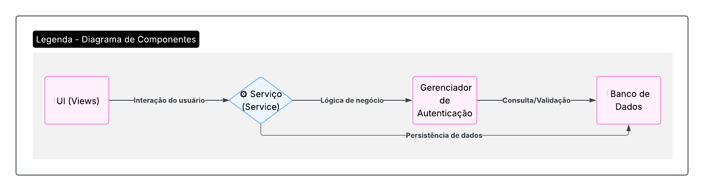

### **Diagrama de Componentes - SustentabilizeJá**

#### **Introdução**

O Diagrama de Componentes é uma representação visual da arquitetura do sistema **SustentabilizeJá**, que descreve os módulos de software, suas interfaces e as dependências entre eles. Ele oferece uma visão estruturada da aplicação, ajudando a compreender como as diferentes partes interagem para entregar as funcionalidades propostas, desde a autenticação de um usuário até o gerenciamento de recompensas.

A modelagem desses componentes é fundamental para definir responsabilidades, identificar módulos reutilizáveis e facilitar a comunicação técnica entre a equipe de desenvolvimento, garantindo uma base sólida para a construção e manutenção da plataforma.

#### **Metodologia**

Para a elaboração do diagrama, a equipe seguiu um processo estruturado:

1.  **Análise dos Requisitos:** Foi realizada uma revisão das funcionalidades do projeto (onboarding, missões, relatórios, etc.) para identificar os principais módulos de software e suas responsabilidades lógicas.
2.  **Definição da Arquitetura:** Com base nos requisitos, foi definida uma arquitetura em camadas, separando as responsabilidades de interface do usuário (Views), lógica de negócio (Services) e persistência de dados (Banco de Dados).
3.  **Desenho e Refinamento:** Utilizando a ferramenta Lucidchart, o diagrama foi desenhado para detalhar as interações e dependências entre cada `View` e seu respectivo `Service`, bem como a comunicação com componentes centrais como o `AuthenticatorManager` e o `Banco de Dados`.

#### **Diagrama e Descrição dos Componentes**

A seguir, a figura com o diagrama de componentes elaborado para o projeto.

<b>Figura 1.</b>  Legenda do Diagrama de Componentes do SustentabilizeJa 

 

<b>Figura 2.</b>  Diagrama de Componentes do SustentabilizeJa 

<b>Autor:</b>  [Gustavo Gontijo](https://https://github.com/Guga301104), [Ana Luiza Komatsu](https://github.com/luluaroeira) e [Davi Oliveira](https://https://github.com/daviRolvr) 

**Descrição:** O Diagrama de Componentes (Figura 1) ilustra a arquitetura lógica da aplicação **SustentabilizeJá**, organizada em camadas claras de responsabilidade:

* **UI FrontEnd (Views):** Esta camada agrupa todos os componentes de visualização, que formam a interface direta com o usuário. Cada `View` (como `Login View`, `Desafios e Missões View` e `Relatórios Mensais View`) é responsável por renderizar uma tela específica e capturar as interações do usuário.

* **Camada de Serviços (Services):** Representa o núcleo da lógica de negócio da aplicação. Cada `View` se comunica com um `Service` correspondente (ex: `Cadastro View` interage com `CadastroService`), que é responsável por processar as requisições, aplicar as regras de negócio e orquestrar as operações necessárias.

* **AuthenticatorManager:** É um componente de gestão centralizado, responsável especificamente pela lógica de autenticação e registro. Ele recebe as solicitações dos componentes `LoginService` e `CadastroService` para validar credenciais e gerenciar o acesso dos usuários de forma segura.

* **Banco de Dados:** Este componente representa a camada de persistência. Ele é acessado diretamente tanto pelo `AuthenticatorManager` (para dados de usuários) quanto por diversos `Services` (como `RecompensaService`, `ImpactoService` e `DesafiosService`) para armazenar e recuperar todas as informações da plataforma.

O fluxo geral se inicia na `UI FrontEnd`, passa pela camada de `Services` que processa a lógica, e finaliza com a interação com o `AuthenticatorManager` ou diretamente com o `Banco de Dados` para a manipulação dos dados.

#### **Conclusão**

A construção deste diagrama de componentes foi essencial para a equipe, pois permitiu detalhar a arquitetura lógica e o fluxo de dados do **SustentabilizeJá**. A clara separação de responsabilidades entre as camadas de visualização (`Views`), lógica de negócio (`Services`) e persistência (`Banco de Dados`) não só facilita o desenvolvimento paralelo, mas também promove a manutenibilidade e a escalabilidade futuras do sistema.

## Histórico de Versões

| Versão | Descrição                            | Autor(es)                                                                                         | Data       | Revisor(es)                                                                                                 | Data de Revisão |
| ------ | ------------------------------------ | ------------------------------------------------------------------------------------------------- | ---------- | ----------------------------------------------------------------------------------------------------------- | --------- |
| 1.0    | Criação e inclusão do Diagrama de Componentes | [Gustavo Gontijo](https://https://github.com/Guga301104), [Ana Luiza Komatsu](https://github.com/luluaroeira) e [Davi Oliveira](https://https://github.com/daviRolvr) | 18/09/2025 | [Lucas Mendonça Arruda](https://github.com/lucasarruda9) | 18/09/2025|