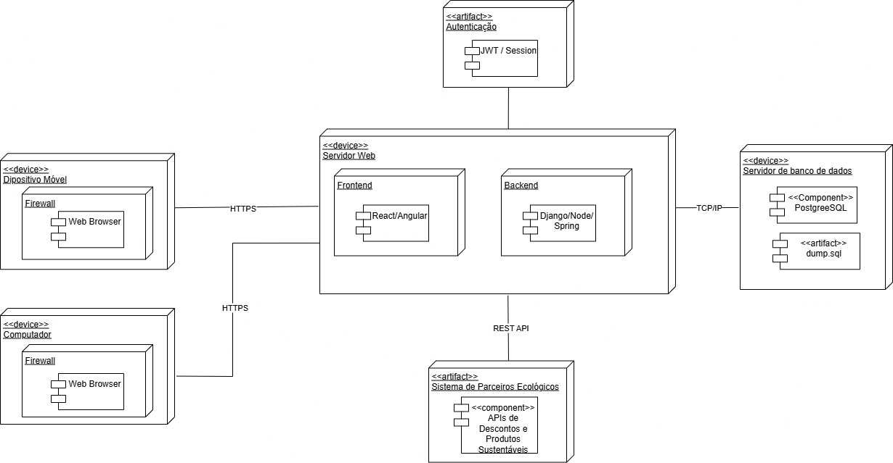
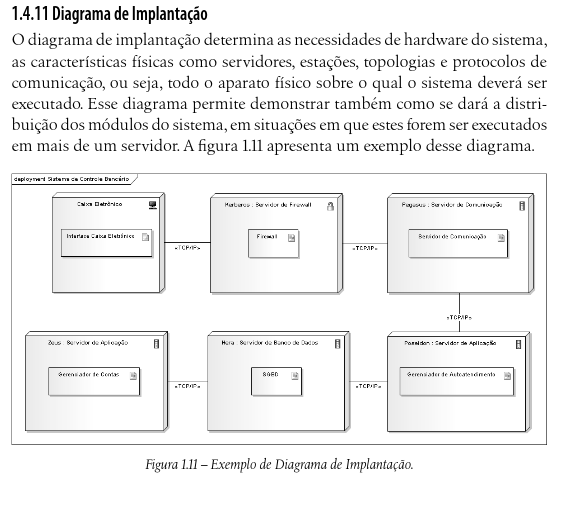

# **Diagrama de Implantação**

## **Introdução**

<q>O diagrama de implantação determina as necessidades de hardware do sistema,
as características físicas como servidores, estações, topologias e protocolos de
comunicação, ou seja, todo o aparato físico sobre o qual o sistema deverá ser
executado.<a id="anchor_1" href=#FRM1> [1]</a> .</q> (GUEDES, 2011, p. 39).

## **Metodologia**

A metodologia adotada durante o desenvolvimento deste diagrama seguiu um processo colaborativo e iterativo entre os integrantes da equipe. Inicialmente, foi realizada uma reunião para compreender os conceitos fundamentais do Diagrama de Implantação, utilizando como base o material recomendado pela professora e complementando com fontes externas, como livros, templates e referências de diagramas já existentes.

A definição das tecnologias também foi parte da metodologia:  
- **Banco de dados:** foi decidido o uso do PostgreSQL, descartando alternativas como Firebase pela maior familiaridade da equipe com a tecnologia.  
- **Frontend:** optou-se preliminarmente pelo uso de React, mas deixou-se em aberto a possibilidade de Vue.js ou Angular, para maior flexibilidade.  
- **Backend:** as opções consideradas foram Django, Spring Boot e Node.js, com inclinação inicial para Django pela integração com o módulo de autenticação.  
- **Autenticação:** após pesquisa, foi definido como prioridade o uso do Django Authentication com JWT, mantendo em aberto a alternativa de Spring Security em versões futuras.  

A equipe também discutiu ajustes na modelagem, como a natureza do nó de sistema de recompensas, que foi reclassificado como artefato. Esse processo de refinamento foi essencial para alinhar a modelagem ao contexto técnico e prático do projeto.

## Composição do Diagrama

Um Diagrama de Implantação é normalmente composto por:

**Nó:**  
Representa um recurso computacional onde o software será executado, podendo ser associado a artefatos implantados no nó. Sua representação é um cubo 3D.  
- O nó pode ser considerado um dispositivo físico («device») quando representa um recurso computacional físico com capacidade de processamento, no qual artefatos podem ser implantados para execução.  

- O nó pode ser considerado um ambiente de execução («executionEnvironment») quando é um nó de software que oferece um ambiente de execução para tipos específicos de componentes que são implantados nele como artefatos executáveis. O ambiente de execução fornece um conjunto padrão de serviços que os componentes requerem em tempo de execução.

**Artefato:**  
Representa elementos físicos resultantes do desenvolvimento de software, onde cada artefato é implantado em um nó, indicando que aquele software roda naquele recurso.  

Em UML 2, artefatos podem manifestar componentes, ou seja, implementar partes do sistema.

**Componentes (Component):**  
Representam partes modulares do sistema, com interfaces fornecidas e requeridas.  
- Componentes podem ser substituídos por outros se forem compatíveis com as mesmas interfaces.  
- São implantados indiretamente nos nós, através dos artefatos.

**Caminho de comunicação/associação:**  
São as conexões entre dois nós de um sistema. A conexão entre dois nós é geralmente representada por protocolos, enquanto a conexão entre dois dispositivos físicos é geralmente representada por sua conexão física.

Fonte: Elaborado pelo autor ([Artur Mendonça Arruda](https://github.com/ArtyMend07), [Gabriel Lopes de Amorim](https://github.com/BrzGab) e [Lucas Mendonça Arruda](https://github.com/lucasarruda9), 2025).

## **Análise Crítica da Implantação**

Durante a implementação do diagrama, diversos pontos positivos e negativos puderam ser observados:

- **Aspectos positivos:**  
  - A equipe demonstrou iniciativa ao buscar materiais complementares além das fontes indicadas, o que ampliou a compreensão do modelo.  
  - A definição de tecnologias como PostgreSQL e React considerou tanto o conhecimento prévio quanto a escalabilidade futura.  
  - O processo de revisão colaborativa permitiu a identificação de inconsistências (ex.: redefinição do sistema de recompensas como artefato).  

- **Aspectos críticos:**  
  - Houve indecisão excessiva em pontos-chave, como a escolha definitiva do backend e do método de autenticação. Isso pode comprometer a padronização do sistema em fases futuras.  
  - A multiplicidade de opções abertas (React/Angular/Vue; Django/Node/Spring; diferentes métodos de autenticação) pode gerar retrabalho e dificuldade de integração, caso não haja consenso rápido.  
  - A retirada do módulo de autenticação do diagrama, sob a justificativa de que tem o mesmo componente no backend (Django), pode fragilizar a clareza do modelo.

De modo geral, a implementação foi satisfatória para um primeiro ciclo, mas deixou em aberto muitas decisões críticas que precisarão ser consolidadas em versões futuras para garantir consistência, clareza e robustez arquitetural.

## Gravação da Reunião

A seguir está disponível a gravação em vídeo que ilustra o processo de discussão e implementação do diagrama:

Link da reunião em: https://youtu.be/JECiY33o470

## Referências Bibliográficas

> <a id="FRM1" href="#anchor_1">1.</a>GUEDES, Gilleanes T. A. UML 2: uma abordagem prática. 2. ed. São Paulo: Novatec, 2011.

## Bibliografia

SOMMERVILLE, Ian. Engenharia de Software. 10. ed. São Paulo: Pearson, 2019.

UML Diagrams. Deployment diagrams. Disponível em: https://www.uml-diagrams.org/deployment-diagrams.html

## Histórico de Versões

| Versão | Descrição                            | Autor(es)                                                                                         | Data       | Revisor(es)                                                                                                 | Data de Revisão |
| ------ | ------------------------------------ | ------------------------------------------------------------------------------------------------- | ---------- | ----------------------------------------------------------------------------------------------------------- | --------- |
| 1.0    | Criação e inclusão do Diagrama de Implantação | [Artur Mendonça Arruda](https://github.com/ArtyMend07), [Gabriel Lopes de Amorim](https://github.com/BrzGab) e [Lucas Mendonça Arruda](https://github.com/lucasarruda9) | 20/09/2025 |  | |
| 1.1    | Adição da metodologia e da análise crítica  | [Artur Mendonça Arruda](https://github.com/ArtyMend07) | 20/09/2025 |  | |