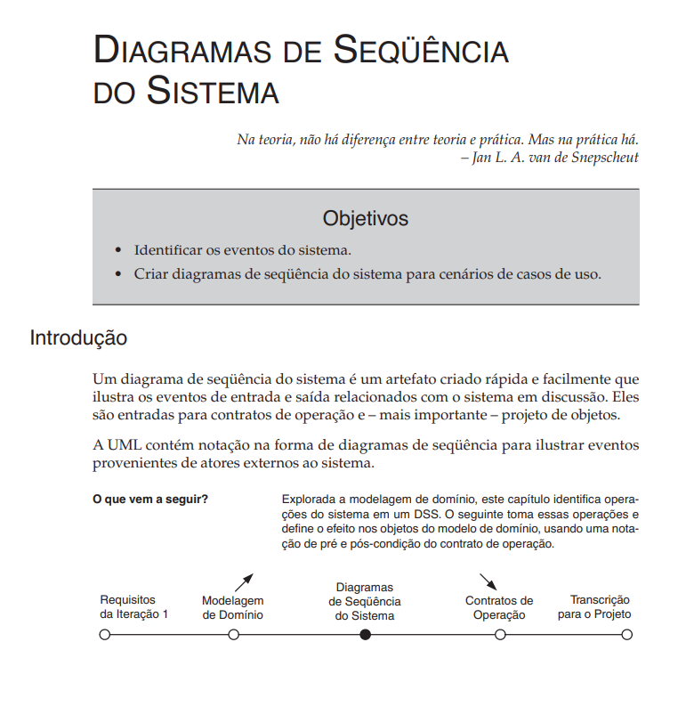

# Diagrama de Sequência

## Introdução

O Diagrama de Sequência é um dos diagramas da UML (Unified Modeling Language) utilizado para representar a interação entre os objetos de um sistema ao longo do tempo. <q>Normalmente, um diagrama de sequência captura o comportamento de um único cenário. O diagrama mostra vários exemplos de objetos e mensagens que são passadas entre esses objetos dentro de um caso de uso." <a id="anchor_1" href=#FRM1> [1]</a> .</q> (FOWLER, 2007, p. 67).

## Metodologia

O diagrama de sequência foi desenvolvido após a observação dos principais casos de uso do sistema **SustentabilidadeJá**, foram identificados os atores envolvidos, os componentes que participariam de cada interação e foi definido os fluxos de mensagens trocadas entre interface, controladores, serviços e banco de dados.

Para a modelagem do diagrama, foi utilizada a ferramenta de diagramação Draw.io, explorando sua praticidade para criar diagramas de forma organizada e com boa legibilidade. A construção dos diagramas foi orientada pelos livros que estão nas referências bibliográficas e também pelos conteúdos disponibilizados pela professora Milene Serrano, incluindo exemplos de sequence diagrams e diretrizes de boas práticas em UML, assegurando a consistência da notação e a fidelidade ao comportamento esperado do sistema.

Para a construção dos diagramas, foram utilizados os seguintes elementos:

| Elemento | Descrição | Exemplo |
|--|--|--|
| **Entidades** | Representam uma classe, objetos ou entidades em UML |  |
| **Linhas de Vida** | Um diagrama de sequência é composto por várias dessas notações de linha de vida que devem ser organizadas horizontalmente na parte superior do diagrama. Elas representam os diferentes objetos ou partes que interagem entre si no sistema durante a sequência. |  |
| **Barras de Ativação** | A barra de ativação é a caixa colocada na linha de vida. É usado para indicar que um objeto está ativo (ou instanciado) durante uma interação entre dois objetos. O comprimento do retângulo indica a duração dos objetos que permanecem ativos. |  |
| **Mensagem síncrona** | uma mensagem síncrona é usada quando o remetente espera que o receptor processe a mensagem e retorne antes de continuar com outra mensagem. A ponta de seta usada para indicar este tipo de mensagem é sólida. |  |
| **Mensagem de retorno** | Uma mensagem de retorno é usada para indicar que o receptor da mensagem terminou o processamento da mensagem e está devolvendo o controle para o autor da chamada da mensagem. As mensagens de retorno são peças opcionais de notação, para uma barra de ativação que é acionada por uma mensagem síncrona implica sempre uma mensagem de retorno. |  |
| **Boundary Object (Objeto de Fronteira)** | O objeto de fronteira (boundary) representa a interface entre o sistema e seus usuários ou sistemas externos. Ele é responsável por receber entradas dos atores e exibir saídas, funcionando como uma ponte entre o mundo externo e o sistema. Exemplos comuns incluem telas, formulários e interfaces de APIs. |  |
| **Control Object (Objeto de Controle)** | O objeto de controle coordena o fluxo de um caso de uso, centralizando a lógica do processo. Ele orquestra as interações entre os objetos de fronteira e os de entidade, sendo responsável por tomar decisões e aplicar regras de negócio. |  |
| **Entity Object (Objeto de Entitidade)** | O objeto de entidade representa informações do domínio que devem ser armazenadas ou manipuladas pelo sistema. Ele contém dados persistentes e a lógica associada a esses dados, como cálculos, validações ou relações. |  |

## Participação na Produção do Artefato

| Nome do Integrante | Artefato | Descrição da Contribuição | Análise Crítica |
|--------------------|----------|---------------------------|-----------------|
| [Gabriel Lopes](https://github.com/BrzGab) | Diagrama de Sequência | Fiquei responsável por elaborar os três diagramas de sequência referentes aos principais casos de uso do sistema: **Registrar Ações Sustentáveis**, **Visualizar Impacto Ambiental** e **Marketplace**. No desenvolvimento, defini os atores envolvidos, especifiquei o papel da interface, detalhei os serviços acionados e modelei as mensagens trocadas entre frontend, backend e banco de dados. Busquei garantir clareza nos fluxos, consistência no uso da notação UML e fidelidade à lógica proposta para a aplicação. | A construção desses diagramas me permitiu compreender com mais profundidade o encadeamento das interações entre os componentes e a importância de representar de forma explícita responsabilidades de interface, controlador, serviços e banco. Percebi que esse tipo de diagrama não apenas documenta, mas também ajuda a validar os requisitos e identificar possíveis gargalos ou repetições de lógica antes da implementação. |

## Resultados

Diagrama de Sequência - Registrar ação sustentável:

Autor: [Gabriel Lopes](https://github.com/BrzGab), 2025.

Diagrama de Sequência - Visualizar impacto ambiental:

Autor: [Gabriel Lopes](https://github.com/BrzGab), 2025.

Diagrama de Sequência - Marketplace:

Autor: [Gabriel Lopes](https://github.com/BrzGab), 2025.

# Análise Crítica

A elaboração dos Diagramas de Sequência para o **SustentabilidadeJá** foi fundamental para detalhar o comportamento dinâmico do sistema e compreender o encadeamento das interações entre usuários, interfaces, controladores, serviços e banco de dados. Esse artefato contribuiu de maneira decisiva para a validação dos requisitos e para o alinhamento técnico entre os integrantes da equipe.

## Pontos Relevantes
- A escolha de **três cenários principais** (Registrar Ações Sustentáveis, Visualizar Impacto Ambiental e Marketplace) mostrou-se eficaz para representar funcionalidades críticas do sistema, assegurando foco nos casos de maior relevância.  
- A utilização consistente da notação UML reforçou a clareza e a padronização do modelo, facilitando a leitura e a comunicação dentro da equipe.  
- A distinção entre **objetos de fronteira (boundary), controle (control) e entidade (entity)** permitiu representar de forma explícita as responsabilidades de cada elemento na interação.  
- O processo de construção proporcionou uma visão integrada do fluxo de mensagens, antecipando potenciais gargalos e oferecendo suporte à tomada de decisões de design antes da fase de implementação.  

## Possibilidades de Evolução
- Os diagramas foram elaborados com um nível de detalhamento adequado para esta etapa do projeto. Em versões futuras, pode ser interessante **expandir cenários complementares**, como notificações automáticas ou relatórios avançados, para enriquecer ainda mais a documentação.  
- A modelagem manteve-se fiel à lógica central da aplicação; entretanto, à medida que o sistema evoluir, os diagramas podem ser ajustados para contemplar **interações externas**, como APIs de parceiros ou serviços de autenticação de terceiros.  
- A notação de mensagens já está bem definida, mas pode ser complementada com **exceções ou fluxos alternativos** (ex.: falha no login ou indisponibilidade do banco), agregando valor ao processo de análise de riscos.  

## Conclusão
Os Diagramas de Sequência detalham o fluxo das principais funcionalidades do sistema, como Registrar ações sustentáveis, visualizar impacto ambiental e marketplace. Eles facilitam o entendimento do comportamento do sistema, apoiam a validação dos requisitos e contribuem para uma comunicação clara entre os membros da equipe por meio da padronização UML.

## Referências Bibliográficas

> <a id="FRM1" href="#anchor_1">1.</a>Fowler, Martin Fowler, Martin
UML essencial [recurso eletrônico] : um breve guia para a UML essencial [recurso eletrônico] : um breve guia para a
linguagem-padrão de modelagem de objetos / Martin Fowler ; linguagem-padrão de modelagem de objetos / Martin Fowler ;
tradução João tradução João Tortello. – 3. ed. – Dados eletrônicos. – Porto ortello. – 3. ed. – Dados eletrônicos. – Porto
Alegre : Bookman, 2007.

> 2.</a>Larman, Craig. UTILIZANDO UML E PADRÕES: Uma introdução a análise e ao projeto orientados a objetos e ao desenvolvimento iteratico. 3. ed. São Paulo: Bookman, 2007.

## Bibliografia

> 1. BRASIL. The Club. Diagrama de sequência UML. Disponível em: <http://www.theclub.com.br/restrito/revistas/201308/umld1308.aspx>. Acesso em: 20 de setembro de 2025.
>
> 2. ROCHA, Givanaldo. Diagrama de sequência – Engenharia de Software. IFRN. Disponível em: <https://docente.ifrn.edu.br/givanaldorocha/disciplinas/engenharia-de-software-licenciatura-em-informatica/diagrama-de-sequencia>. Acesso em: 20 de setembro de 2025.
>
> 3. SERRANO, Milene. **06a - VideoAula - DSW-Modelagem - Sequência**. [Apostila e vídeo]. Plataforma Aprender, 2024. Acesso em: 19 de setembro de 2025.

## Histórico de Versões

| Versão | Descrição                            | Autor(es)                                                                                         | Data       | Revisor(es)                                                                                                 | Data de Revisão |
| ------ | ------------------------------------ | ------------------------------------------------------------------------------------------------- | ---------- | ----------------------------------------------------------------------------------------------------------- | --------- |
| 1.0    | Criação do documento e diagramas |  [Gabriel Lopes ](https://github.com/BrzGab) | 21/09/2025 |  [Lucas de Oliveira ](https://github.com/LucasOliveiraDiasMarquesFerreira) |22/09/2025 |
| 1.1    | Analise Critica do Artefato |  [Lucas de Oliveira ](https://github.com/LucasOliveiraDiasMarquesFerreira) | 22/09/2025 |  | |
