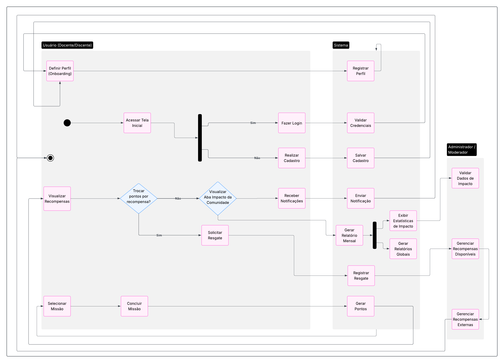

### **Diagrama de Atividades**

#### **Introdução**

Conforme definido pela Unified Modeling Language (UML), o diagrama de atividades tem o propósito de "modelar o fluxo de trabalho (workflow) de um sistema e o fluxo de controle entre objetos" (BOOCH; RUMBAUGH; JACOBSON, 2005, p. 257). Por meio dele, é possível descrever a operação da plataforma SustentabilizeJá, modelando as atividades, os pontos de decisão e os comportamentos resultantes dessas escolhas. Com este diagrama, conseguimos visualizar processos complexos de forma clara, facilitando a análise e a comunicação dos fluxos existentes no sistema. Nosso objetivo ao utilizar esta ferramenta na fase de desenho do software é avaliar os caminhos lógicos e as alternativas de execução, garantindo decisões mais assertivas sobre o desenvolvimento do projeto.

#### **Metodologia**

Para a construção do modelo, foi elaborado um diagrama que abrange todas as atividades consideradas relevantes para o funcionamento da plataforma. O diagrama de atividades consolida os diferentes fluxos de interação, tanto do usuário (comunidade acadêmica no geral) quanto do sistema e do administrador/moderador. As principais atividades modeladas para o projeto **SustentabilizeJá** são:

* Definição de Perfil (Onboarding) e Registro de Perfil;
* Acesso à Tela Inicial, Login e Cadastro de Usuário;
* Visualização de Recompensas e Decisão de Troca de Pontos;
* Solicitação de Resgate de Recompensas;
* Visualização da Aba de Impacto da Comunidade e Recebimento de Notificações;
* Seleção e Conclusão de Missões e Geração de Pontos;
* Exibição de Estatísticas de Impacto, Geração de Relatórios (Mensal e Global);
* Gerenciamento de Dados de Impacto, Recompensas Disponíveis e Recompensas Externas pelo Administrador/Moderador.

#### **Diagrama e Descrição dos Fluxos**

A seguir, a figura com o diagrama de atividades elaborado para o projeto, seguida pela tabela de descrição dos fluxos.

<b>Figura 1.</b>  Diagrama de Atividades do SustentabilidadeJa 

<b>Autor:</b>  [Gustavo Gontijo](https://https://github.com/Guga301104), [Ana Luiza Komatsu](https://github.com/luluaroeira) e [Davi Oliveira](https://https://github.com/daviRolvr) 

A tabela abaixo apresenta descrições sucintas sobre os principais fluxos presentes no diagrama de atividades.

**Tabela 1: Breve descrição dos fluxos do diagrama de atividades do SustentabilizeJá**

| Fluxo                                       | Descrição                                                                                                                                                                                                                                                                                                                                                                                           |
| :------------------------------------------ | :-------------------------------------------------------------------------------------------------------------------------------------------------------------------------------------------------------------------------------------------------------------------------------------------------------------------------------------------------------------------------------------------------- |
| **Definição e Registro de Perfil** | Processo inicial onde o usuário define seu perfil (docente/discente) durante o onboarding, e o sistema registra essa informação, configurando o perfil do usuário na plataforma.                                                                                                                                                                                                                    |
| **Acesso, Login e Cadastro** | O usuário acessa a tela inicial. Se já tiver cadastro, realiza o login validando suas credenciais. Caso contrário, é direcionado para a tela de registro de um novo usuário, onde o sistema salva o cadastro e registra o perfil.                                                                                                                                                                |
| **Visualização de Recompensas e Decisão** | Após o login, o usuário pode visualizar as recompensas disponíveis. Uma decisão é tomada: se deseja trocar pontos por recompensas ("Sim") ou continuar a interação sem resgate ("Não"), seguindo para outras funcionalidades como a visualização do impacto da comunidade ou o recebimento de notificações.                                                                                      |
| **Solicitação de Resgate** | Se o usuário decidir trocar pontos por recompensas, ele solicita o resgate. O sistema registra essa solicitação e posteriormente a encaminha para gerenciamento do administrador/moderador.                                                                                                                                                                                                       |
| **Impacto da Comunidade e Notificações** | O usuário pode visualizar a aba de impacto da comunidade, que exibe estatísticas gerais e relatórios. Além disso, o sistema envia e o usuário recebe notificações importantes.                                                                                                                                                                                                                    |
| **Seleção, Conclusão de Missões e Pontuação** | O usuário seleciona uma missão, realiza as atividades propostas e a conclui. Em seguida, o sistema gera os pontos correspondentes à missão e os registra no perfil do usuário.                                                                                                                                                                                                                        |
| **Gerenciamento do Administrador/Moderador** | Engloba as atividades de backend e gestão: o administrador/moderador valida os dados de impacto, gerencia as recompensas disponíveis para os usuários, gera relatórios mensais e globais, e cuida do gerenciamento de recompensas externas.                                                                                                                                                         |
| **Encerramento** | Representa o fim de um fluxo de atividades específico dentro da plataforma, indicando um ponto de conclusão ou retorno a um estado inicial, como o logout ou a finalização de uma ação.                                                                                                                                                                                                                |

# Análise Crítica

O diagrama de atividades elaborado para o **SustentabilizeJá** foi fundamental para representar de maneira clara os fluxos de interação do sistema, tanto do ponto de vista do usuário quanto do administrador. O artefato nos ajudou a compreender a sequência lógica dos processos e as decisões que direcionam os diferentes caminhos dentro da plataforma.

## Pontos Relevantes
- A escolha de **abranger fluxos completos** (desde o onboarding até o gerenciamento de recompensas pelo administrador) proporcionou uma visão integrada e coerente do funcionamento da plataforma.  
- O diagrama contribuiu para tornar explícitos os **pontos de decisão e alternativas de execução**, o que facilita a validação das regras de negócio.  
- A **documentação complementar com tabela descritiva** foi um diferencial, pois conecta a representação visual à explicação textual, favorecendo a compreensão e a comunicação entre os integrantes da equipe.  
- A modelagem apoia diretamente a fase de desenho do software, permitindo alinhar expectativas e reduzir ambiguidades nos requisitos.  

## Possibilidades de Evolução
- O diagrama foi construído em um **nível de abstração adequado para este estágio do projeto**. Em versões futuras, pode ser detalhado para incluir **exceções e fluxos alternativos**, como falhas de autenticação ou erros no resgate de recompensas.  
- A representação já diferencia claramente as responsabilidades do usuário e do administrador. Ainda assim, há espaço para destacar de forma mais explícita as **interações entre sistema e atores externos**, como parceiros de recompensas ou integrações institucionais.  
- A partir deste modelo geral, poderão ser desenvolvidos **subdiagramas focados em casos específicos**, oferecendo maior granularidade na documentação sem perder a visão de alto nível.  

## **Referências**

[1] OMG. *Unified Modeling Language (UML) Specification*. Disponível em: `https://www.omg.org/spec/UML`. Acesso em: 06 mai. 2025.
 [2] Kirill Fakhroutdinov. *Activity Diagrams*. Disponível em: `https://www.uml-diagrams.org/activity-diagrams.html`. Acesso em: 06 mai. 2025.
 [3] IBM. *Criando Diagramas de Atividades*. Disponível em: `https://www.ibm.com/docs/pt-br/rational-soft-arch/9.7.0?topic=diagrams-creating-activity`. Acesso em: 09 mai. 2025.
 [4] LucidChart. *O que é diagrama de atividades UML?*. Disponível em: `https://www.lucidchart.com/pages/pt/o-que-e-diagrama-de-atividades-uml#:~:text=familiarizadas%20com%20UML,guia%20lhe%20ensinar%C3%A1%20no%C3%A7%C3%B5es%20b%C3%A1sicas`. Acesso em: 09 mai. 2025.                                                              |

## Histórico de Versões

| Versão | Descrição                            | Autor(es)                                                                                         | Data       | Revisor(es)                                                                                                 | Data de Revisão |
| ------ | ------------------------------------ | ------------------------------------------------------------------------------------------------- | ---------- | ----------------------------------------------------------------------------------------------------------- | --------- |
| 1.0    | Criação e inclusão do Diagrama de Atividades | [Gustavo Gontijo](https://https://github.com/Guga301104), [Ana Luiza Komatsu](https://github.com/luluaroeira) e [Davi Oliveira](https://https://github.com/daviRolvr) | 18/09/2025 | [Lucas Mendonça Arruda](https://github.com/lucasarruda9) | 18/09/2025|
| 1.1    | Analise Critica | [Lucas de Oliveira](https://github.com/LucasOliveiraDiasMarquesFerreira) | 22/09/2025 | [Lucas Mendonça Arruda](https://github.com/lucasarruda9) | 22/09/2025|
