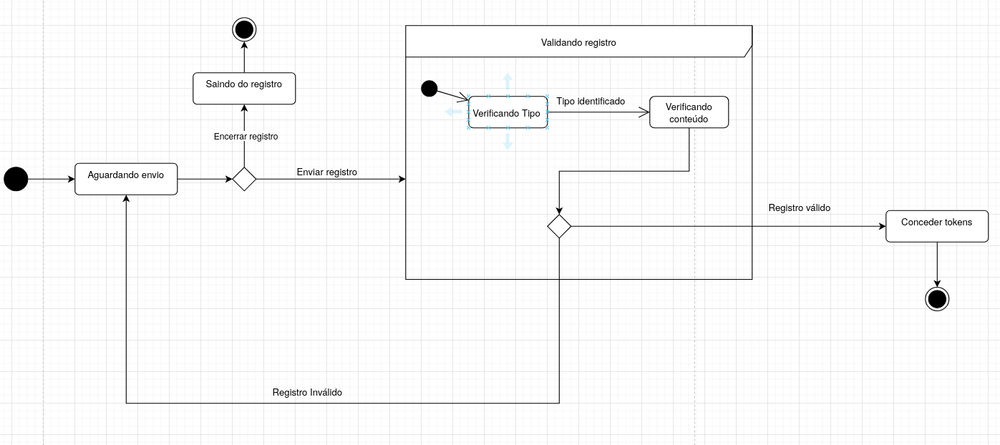
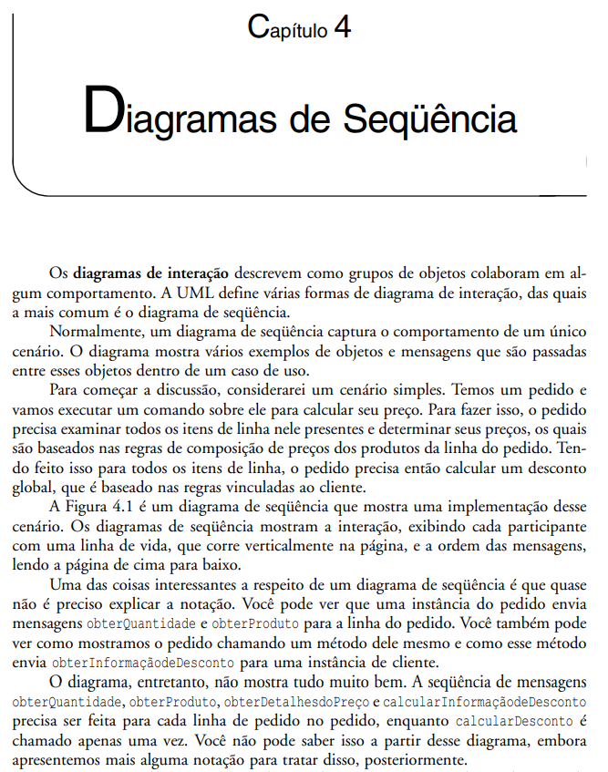
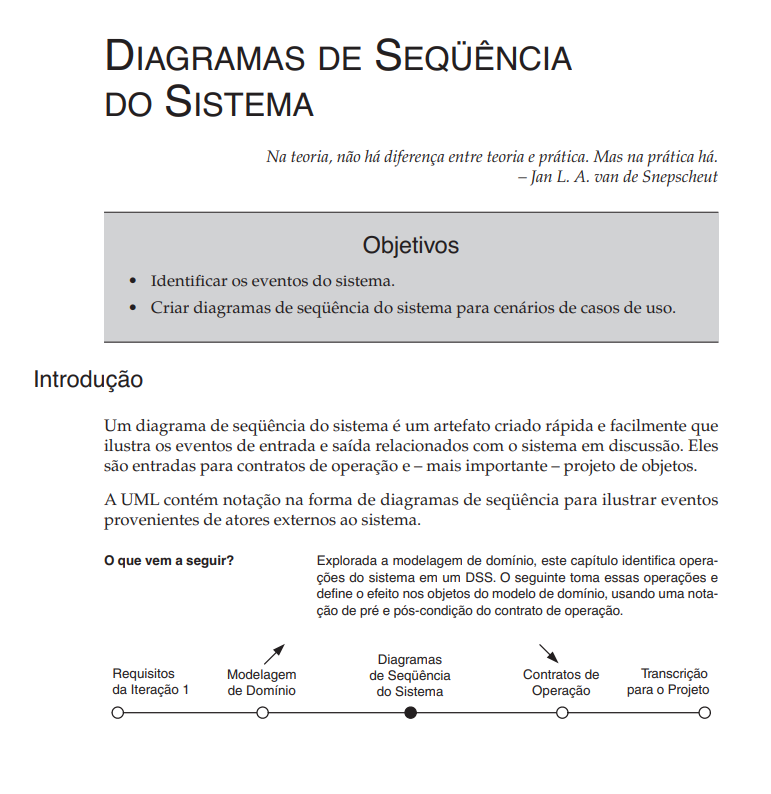

# Diagrama de Estados

## Introdução

O diagrama de estados, dentro da UML, é empregado para representar o comportamento de um elemento a partir de suas possíveis transições. Ele pode ser usado tanto para mostrar como uma parte do sistema se comporta quanto para indicar as regras de utilização dessa parte. Assim como os diagramas de sequência, também pode estar relacionado a casos de uso ou acompanhar os estados de outros elementos, como objetos de uma classe <a id="anchor_1" href=#FRM1> [1]</a> (GUEDES, 2011, p. 39).

## Metodologia

Para a construção dos diagramas, foram utilizados os seguintes elementos:

| Elemento | Descrição | Exemplo |
|--|--|
| **Estado Inicial** | O estado inicial não é considerado um estado real, mas sim um pseudostate que indica o ponto de início de uma região ou de um estado composto. Ele é representado por um pequeno círculo sólido preenchido|  |
| **Estado Simples** | É aquele que não possui subestados, regiões ou submáquinas. Ele é representado por um retângulo com cantos arredondados com o nome do estado dentro. |  |
| **Estado Composto** | Um estado composto é um estado que pode ser dividido em outros menores, chamados de subestados. Esses subestados podem acontecer em sequência ou ao mesmo tempo. |  |
| **Estado Final** | Um estado final indica que a região ou máquina de estados que o contém foi concluída. Ele é considerado um tipo de estado, diferente do estado inicial, que é um pseudo estado. Ele é representado por um círculo com um círculo menor preenchido dentro. |  |
| **Transição** | As transições conectam os estados, representadas por linhas com seta apontando para o estado de destino. Elas podem receber um nome referente ao evento que as dispara, quando esse evento ocorre a transição é executada |  |
| **Estado de escolha** | O estado de escolha é um pseudo estado que representa uma decisão condicional dinâmica, escolhendo apenas uma transição de saída com base nas condições e nos resultados de ações anteriores. Ele é diferente de junções estáticas e é representado por um losango |  |

Fonte: Tabela elaborado por [Gabriel Lopes](https://github.com/BrzGab) e [Lucas Mendonça Arruda](https://github.com/lucasarruda9)

## Diagramas

### Diagrama de Estados - Login

### Diagrama de Estados - Registrar Ação

Fonte: elaborado por [Lucas Mendonça Arruda](https://github.com/lucasarruda9)

O diagrama de estados da funcionalidade Registrar Ação inicia no estado Aguardando Envio, que representa o momento em que o sistema está esperando que o usuário envie os dados do registro. A partir desse ponto, existem duas possibilidades: se o usuário decidir encerrar o registro, ele sai do processo e a execução da função termina; caso o usuário envie o registro, o fluxo segue para um estado composto de Validando Registro.

Dentro do estado composto, a execução começa no estado Verificando Tipo, onde o sistema identifica o tipo de registro enviado, como, por exemplo, uma foto da conta de luz, uma foto da conta de água ou uma foto de uma árvore plantada. Essa identificação é essencial para que o sistema saiba quais regras aplicar na validação e na recompensa.

Após a identificação do tipo, o fluxo passa para o estado Verificando Conteúdo, responsável por analisar os dados e certificar se estão corretos e completos. Depois dessa verificação, existem duas opções: se o registro for inválido, o fluxo retorna para o estado Aguardando Envio, permitindo que o usuário corrija ou reenviar os dados; se o registro for válido, o fluxo segue para o estado Conceder Tokens, onde o sistema recompensa o usuário pela ação registrada. Finalmente, após a concessão de tokens, o fluxo chega ao Estado Final, encerrando a execução da funcionalidade.

### Diagrama de Estados - Marketplace

## Participação na Produção do Artefato

| Nome do Integrante | Artefato | Descrição da Contribuição | Análise Crítica |
|--------------------|----------|---------------------------|-----------------|
| [Artur Mendonça Arruda](https://github.com/ArtyMend07) | Diagrama de marketplace |  | |
| [Gabriel Lopes](https://github.com/BrzGab) | Diagrama de login |  | |
| [Lucas Mendonça Arruda](https://github.com/lucasarruda9) | Diagrama de Registro de ação | Fui responsável por elaborar o diagrama de estados da função Registrar Ação do sistema SustabilidadeJá. Além disso, durante a reunião, revisei os diagramas de Marketplace e de Login. Também contribui com a criação desse artefato adicionando seção de introdução, referência bibliográfica e bibliografia | O diagrama de estados foi feito durante uma reunião, o que ajudou bastante, porque os outros integrantes puderam revisar e dar feedback na hora, mantendo todos alinhados. Um ponto que precisa melhorar é a padronização do modelo do diagrama. Os outros conseguiram seguir o mesmo padrão, mas por falta de tempo e de conhecimento das formas do Draw.io acabei usando uma versão um pouco diferente, em que só as cores mudam. |

## Conclusão
O diagrama de estados desenvolvido permitiu visualizar de forma clara o comportamento das principais funcionalidades do sistema SustabilidadeJá, mostrando como os elementos transitam entre diferentes estados. A construção colaborativa do artefato, realizada durante a reunião, possibilitou revisão e alinhamento entre os integrantes, garantindo feedback imediato e maior consistência. Apesar de pequenas diferenças em alguns modelos, a experiência contribuiu significativamente para o aprendizado sobre diagramas de estados, padronização de artefatos UML e trabalho em equipe.

## Referências Bibliográficas

> <a id="FRM1" href="#anchor_1">1.</a>Fowler, Martin Fowler, Martin
UML essencial [recurso eletrônico] : um breve guia para a UML essencial [recurso eletrônico] : um breve guia para a
linguagem-padrão de modelagem de objetos / Martin Fowler ; linguagem-padrão de modelagem de objetos / Martin Fowler ;
tradução João tradução João Tortello. – 3. ed. – Dados eletrônicos. – Porto ortello. – 3. ed. – Dados eletrônicos. – Porto
Alegre : Bookman, 2007.

> 2.</a>Larman, Craig. UTILIZANDO UML E PADRÕES: Uma introdução a análise e ao projeto orientados a objetos e ao desenvolvimento iteratico. 3. ed. São Paulo: Bookman, 2007.

## Bibliografia

> 1. BRASIL. The Club. Diagrama de sequência UML. Disponível em: <http://www.theclub.com.br/restrito/revistas/201308/umld1308.aspx>. Acesso em: 20 de setembro de 2025.
>
> 2. ROCHA, Givanaldo. Diagrama de sequência – Engenharia de Software. IFRN. Disponível em: <https://docente.ifrn.edu.br/givanaldorocha/disciplinas/engenharia-de-software-licenciatura-em-informatica/diagrama-de-sequencia>. Acesso em: 20 de setembro de 2025.
>
> 3. SERRANO, Milene. **06a - VideoAula - DSW-Modelagem - Sequência**. [Apostila e vídeo]. Plataforma Aprender, 2024. Acesso em: 19 de setembro de 2025.

## Histórico de Versões

| Versão | Descrição                            | Autor(es)                                                                                         | Data       | Revisor(es)                                                                                                 | Data de Revisão |
| ------ | ------------------------------------ | ------------------------------------------------------------------------------------------------- | ---------- | ----------------------------------------------------------------------------------------------------------- | --------- |
| 1.0    | Adicionando introdução, referências, bibliografia e o diagrama de Registrar ação |  [Lucas Mendonça Arruda](https://github.com/lucasarruda9) | 21/09/2025 |  | |