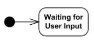
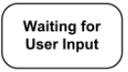
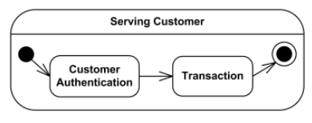
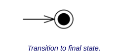
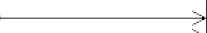
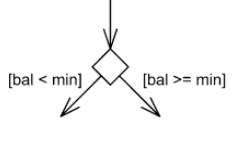

# Diagrama de Estados

## Introdução

O diagrama de estados, dentro da UML, é empregado para representar o comportamento de um elemento a partir de suas possíveis transições. Ele pode ser usado tanto para mostrar como uma parte do sistema se comporta quanto para indicar as regras de utilização dessa parte. Assim como os diagramas de sequência, também pode estar relacionado a casos de uso ou acompanhar os estados de outros elementos, como objetos de uma classe <a id="anchor_1" href=#FRM1> [1]</a> (GUEDES, 2011, p. 39).

## Metodologia

Para a construção dos diagramas de estados do projeto SustentabilidadeJá foram adotadas convenções claras de notação e organização para garantir consistência entre os artefatos, os elementos básicos usados incluem estado inicial, estados simples, estados compostos, estado final, transições e pseudostates de decisão, cada um desses elementos foi representado conforme a prática UML e com pequenas padronizações visuais acordadas na reunião de modelagem.

A nomeação dos estados segue preferencialmente o gerúndio para enfatizar comportamento em execução, por exemplo Estando inativo, Fazendo ações e Acumulando tokens, essa escolha torna o rótulo do estado autoexplicativo sobre a atividade que está ocorrendo enquanto o estado permanece ativo, quando for necessário expressar ações de entrada, saída ou atividades contínuas utiliza-se rótulos sucintos dentro do estado no formato do/while ou entry/exit conforme a necessidade de documentação do comportamento.

As transições são descritas sempre que pertinente com evento, guarda e ação, adotou-se a notação conceitual evento [condição] / ação para facilitar a leitura, exemplos práticos no diagrama do Marketplace incluem guarda como [tokens < preço] e [tokens ≥ preço] sobre as arestas que saem de Estando no carrinho, também há labels textuais diretas quando o evento é autodescritivo como Selecionar produto ou Troca realizada, transições internas que não mudam o estado são distinguidas de transições externas que disparam ações de saída e de entrada.

Para estados compostos a metodologia prevê explicitar o ponto de entrada e de saída e documentar o comportamento dos subestados, no caso do Registrar Ação foi modelado o estado Validando Registro com subestados Verificando Tipo e Verificando Conteúdo, quando for necessário preservar o subestado ativo ao reentrar no composto documenta-se o uso de histórico raso ou profundo, em modelos com regiões concorrentes recomenda-se indicar se há sincronização entre regiões ou se cada região evolui independentemente.

Os pseudostates de decisão foram usados para representar lógica condicional dinâmica, o losango de escolha no Marketplace centraliza a verificação de disponibilidade do produto e de saldo de tokens, diferencia-se a escolha da junção pois a escolha avalia guardas e seleciona uma única saída, sempre que houver possibilidade de guardas sobrepostas recomenda-se explicitar a prioridade ou reescrever as condições para evitar ambiguidade, no diagrama atual as guardas são mutuamente excludentes e exemplificam a decisão típica entre produto indisponível, tokens insuficientes e tokens suficientes.

Quanto ao estilo visual foi adotado um padrão prático, os estados simples são representados por retângulos com cantos arredondados e preenchimento claro, contorno contrastante e texto centralizado para facilitar leitura em imagens exportadas, os pseudostates inicial e final utilizam os símbolos convencionais e as transições mantêm setas com labels curtas, os diagramas foram criados no Draw.io e salvos em assets/Diagramas/Estados com nomes descritivos como Marketplace.png e Registrar_acao.png para facilitar rastreabilidade.

A organização dos arquivos e o versionamento seguiram a estrutura do repositório do grupo, cada artefato de diagrama possui metadados no documento principal indicando autor e fonte, a tabela de histórico de versões registra alterações e responsáveis.

O processo de validação foi realizado de forma síncrona durante a reunião de modelagem, as convenções e decisões foram propostas e acordadas em conjunto, ao término de cada diagrama houve validação entre os integrantes com consenso geral, quando alguém identificou um ponto passível de melhoria ficou acordado que comunicaria para que fossem feitas alterações pontuais, essa etapa de validação imediata reduziu retrabalhos e assegurou que os diagramas refletem o entendimento funcional compartilhado entre os autores.

Por fim, a metodologia documenta de forma explícita elementos complementares que podem ser usados nos diagramas quando pertinentes, entre eles guarda para condições booleanas, ação para efeitos desencadeados pela transição, evento para estímulos externos ou internos, junção para unificação de fluxos estáticos e histórico para preservação de subestados, essas notas auxiliam implementadores e revisores a interpretarem corretamente os artefatos produzidos.

Para a construção dos diagramas, foram utilizados os seguintes elementos:

| Elemento | Descrição | Exemplo |
|--|--|--|
| **Estado Inicial** | O estado inicial é um pseudostate que indica o ponto de entrada de uma região ou de um estado composto, ele não representa comportamento executável por si só, sua única função é disparar a primeira transição ao entrar na região, em estados compostos pode existir um ponto de entrada explícito que direciona para um subestado específico, quando uma região tem múltiplas entradas de inicialização cada entrada deve ser representada por seu pseudostate, em diagramas com regiões paralelas é importante explicitar como os estados iniciais de cada região são tratados para evitar ambiguidade.|  |
| **Estado Simples** | Um estado simples é atômico, ele não possui subestados nem regiões internas, ele pode conter atividades de entrada e saída e também uma atividade do tipo do/while que representa comportamento contínuo enquanto o estado está ativo, recomenda-se explicitar dentro do rótulo do estado as ações relevantes quando for o caso, transições internas que não saem do estado devem ser representadas claramente para distinguir efeitos locais de transições externas que mudam o estado. |  |
| **Estado Composto** | Um estado composto agrupa subestados que podem ser organizados de forma sequencial ou concorrente em regiões ortogonais, o comportamento de um estado composto inclui pontos de entrada e de saída, transições internas entre subestados, e possíveis transições de conclusão que ocorrem quando todas as regiões internas chegam ao estado final, convém documentar se o estado composto admite histórico raso ou profundo para preservar o subestado ativo quando se reentra no composto, em modelos com concorrência deve ficar claro se há sincronização entre regiões ou se cada região evolui independentemente. |  |
| **Estado Final** | Um estado final indica que a região ou máquina de estados que o contém foi concluída. Ele é considerado um tipo de estado, diferente do estado inicial, que é um pseudo estado. Ele é representado por um círculo com um círculo menor preenchido dentro. |  |
| **Transição** | As transições conectam os estados, representadas por linhas com seta apontando para o estado de destino. Elas podem receber um nome referente ao evento que as dispara, quando esse evento ocorre a transição é executada |  |
| **Estado de escolha** | O estado de escolha é um pseudo estado que representa uma decisão condicional dinâmica, escolhendo apenas uma transição de saída com base nas condições e nos resultados de ações anteriores. Ele é diferente de junções estáticas e é representado por um losango |  |

Fonte: Tabela elaborado por [Artur Mendonça Arruda](https://github.com/ArtyMend07), [Gabriel Lopes](https://github.com/BrzGab) e [Lucas Mendonça Arruda](https://github.com/lucasarruda9)

## Diagramas

### Diagrama de Estados - Login

### Diagrama de Estados - Registrar Ação

Fonte: elaborado por [Lucas Mendonça Arruda](https://github.com/lucasarruda9)

O diagrama de estados da funcionalidade Registrar Ação inicia no estado Aguardando Envio, que representa o momento em que o sistema está esperando que o usuário envie os dados do registro. A partir desse ponto, existem duas possibilidades: se o usuário decidir encerrar o registro, ele sai do processo e a execução da função termina; caso o usuário envie o registro, o fluxo segue para um estado composto de Validando Registro.

Dentro do estado composto, a execução começa no estado Verificando Tipo, onde o sistema identifica o tipo de registro enviado, como, por exemplo, uma foto da conta de luz, uma foto da conta de água ou uma foto de uma árvore plantada. Essa identificação é essencial para que o sistema saiba quais regras aplicar na validação e na recompensa.

Após a identificação do tipo, o fluxo passa para o estado Verificando Conteúdo, responsável por analisar os dados e certificar se estão corretos e completos. Depois dessa verificação, existem duas opções: se o registro for inválido, o fluxo retorna para o estado Aguardando Envio, permitindo que o usuário corrija ou reenviar os dados; se o registro for válido, o fluxo segue para o estado Conceder Tokens, onde o sistema recompensa o usuário pela ação registrada. Finalmente, após a concessão de tokens, o fluxo chega ao Estado Final, encerrando a execução da funcionalidade.

### Diagrama de Estados - Marketplace

Fonte: elaborado por [Artur Mendonça Arruda](https://github.com/ArtyMend07)

O diagrama de estados da funcionalidade Marketplace inicia no estado inicial e segue para o estado Estando inativo, que representa o momento em que o usuário ainda não realizou nenhuma ação no sistema, quando o usuário realiza uma ação sustentável o sistema transita para Fazendo ações e ao concluir a ação o fluxo segue para Acumulando tokens onde os créditos são acumulados, a partir desse estado o usuário pode acessar o marketplace e entrar em Navegando no marketplace para visualizar produtos, ao selecionar um produto o fluxo avança para Estando no carrinho onde ocorre uma verificação condicional representada pelo estado de escolha, se o produto estiver indisponível a troca é recusada e o usuário retorna a Navegando no marketplace, se os tokens do usuário forem inferiores ao preço o fluxo segue para Tendo tokens insuficientes permitindo que o usuário opte por realizar mais ações para obter tokens e nesse caso o fluxo pode retornar para Fazendo ações, se os tokens forem iguais ou superiores ao preço a transição segue para Confirmando troca e após a confirmação a troca é realizada levando ao estado Finalizando que encerra o processo, o diagrama também contempla transições que permitem retornar ao marketplace em diferentes pontos do fluxo e retomar a realização de ações antes de confirmar uma troca.

## Participação na Produção do Artefato

| Nome do Integrante | Artefato | Descrição da Contribuição | Análise Crítica |
|--------------------|----------|---------------------------|-----------------|
| [Artur Mendonça Arruda](https://github.com/ArtyMend07) | Diagrama de marketplace | Fui responsável pelo diagrama do Marketplace no projeto SustentabilidadeJá, participei ativamente da sessão síncrona em que os diagramas foram construídos e revisei junto com os demais as decisões de modelagem, durante a reunião propus a convenção de formatação que eu e o Gabriel seguimos, colaborei na identificação dos estados e transições relevantes e garanti que o diagrama representasse fielmente o comportamento esperado da funcionalidade.| a realização do trabalho em reunião síncrona facilitou a resolução imediata de dúvidas e permitiu validação em tempo real das escolhas de modelagem, isso reduziu retrabalhos e alinhou o entendimento funcional entre os integrantes, não houve despadronização relevante porque eu e o Gabriel adotamos a convenção proposta, ao final houve validação dos diagramas de cada integrante com consenso geral e ficou acordado que caso alguém identificasse pontos a melhorar avisaria para que fossem feitas as alterações necessárias, em síntese a dinâmica colaborativa garantiu um artefato consistente e passível de ajustes rápidos quando necessário.|
| [Gabriel Lopes](https://github.com/BrzGab) | Diagrama de login |  | |
| [Lucas Mendonça Arruda](https://github.com/lucasarruda9) | Diagrama de Registro de ação | Fui responsável por elaborar o diagrama de estados da função Registrar Ação do sistema SustabilidadeJá. Além disso, durante a reunião, revisei os diagramas de Marketplace e de Login. Também contribui com a criação desse artefato adicionando seção de introdução, referência bibliográfica e bibliografia | O diagrama de estados foi feito durante uma reunião, o que ajudou bastante, porque os outros integrantes puderam revisar e dar feedback na hora, mantendo todos alinhados. Um ponto que precisa melhorar é a padronização do modelo do diagrama. Os outros conseguiram seguir o mesmo padrão, mas por falta de tempo e de conhecimento das formas do Draw.io acabei usando uma versão um pouco diferente, em que só as cores mudam. |

## Conclusão
O diagrama de estados desenvolvido permitiu visualizar de forma clara o comportamento das principais funcionalidades do sistema SustabilidadeJá, mostrando como os elementos transitam entre diferentes estados. A construção colaborativa do artefato, realizada durante a reunião, possibilitou revisão e alinhamento entre os integrantes, garantindo feedback imediato e maior consistência. Apesar de pequenas diferenças em alguns modelos, a experiência contribuiu significativamente para o aprendizado sobre diagramas de estados, padronização de artefatos UML e trabalho em equipe.

## Referências Bibliográficas

> <a id="FRM1" href="#anchor_1">1.</a>GUEDES, Gilleanes T. A. UML 2: uma abordagem prática. 2. ed. São Paulo: Novatec, 2011.

## Bibliografia

> 1. UML Diagrams. Deployment diagrams. Disponível em: https://www.uml-diagrams.org/state-machine-diagrams.html#google_vignette. Acesso em 21 de setembro de 2025:

> 2. SERRANO, Milene. **06d - VídeoAula - DSW - Modelagem - Diagrama de Estados**. [Apostila e vídeo]. Plataforma Aprender, 2024. Acesso em: 21 de setembro de 2025.

## Histórico de Versões

| Versão | Descrição                            | Autor(es)                                                                                         | Data       | Revisor(es)                                                                                                 | Data de Revisão |
| ------ | ------------------------------------ | ------------------------------------------------------------------------------------------------- | ---------- | ----------------------------------------------------------------------------------------------------------- | --------- |
| 1.0    | Adicionando introdução, referências, bibliografia e o diagrama de Registrar ação |  [Lucas Mendonça Arruda](https://github.com/lucasarruda9) | 21/09/2025 |  | |
| 1.1    | Adicionando análise crítica de Artur Mendonça, diagrama de estados do marketplace, e metodologia |  [Artur Mendonça Arruda](https://github.com/ArtyMend07) | 21/09/2025 |  | |