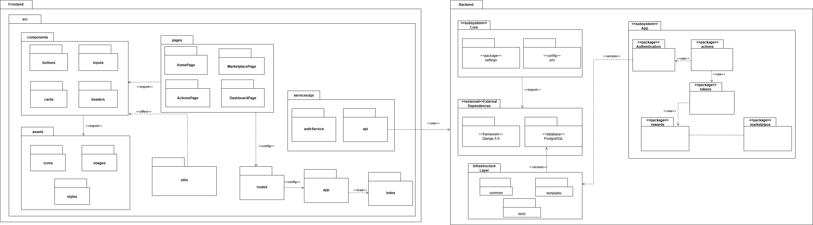
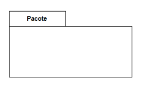

# Diagrama de Pacotes

## Introdução

<q>O diagrama de pacotes é um diagrama estrutural que tem por objetivo represen-
tar os subsistemas ou submódulos englobados por um sistema de forma a de-
terminar as partes que o compõem. Pode ser utilizado de maneira independente
ou associado com outros diagramas. </q> <a id="anchor_1" href=#FRM1> [1]</a> (GUEDES, 2011, p. 33).

Na prática, isso significa que o diagrama de pacotes ajuda a organizar visualmente o sistema em blocos lógicos, mostrando como os diferentes módulos estão agrupados e como se conectam. Essa representação facilita tanto a compreensão da estrutura geral quanto a manutenção do sistema, já que fica mais claro quais partes podem ser modificadas juntas e como cada pacote depende dos outros. Além disso, quando usado junto de outros diagramas, o diagrama de pacotes funciona como um mapa de referência, situando cada componente dentro da arquitetura maior.

# Metodologia

A construção do diagrama de pacotes foi realizada de forma colaborativa em uma reunião entre os integrantes Artur Mendonça Arruda, Gabriel Lopes e Lucas Mendonça Arruda. O processo metodológico adotado envolveu as seguintes etapas:

1. *Revisão de Conceitos e Referências*  
   - Antes da definição final, foram consultadas referências teóricas e exemplos de diagramas UML para garantir que a notação estivesse correta. Essa revisão foi fundamental para esclarecer dúvidas, como a posição do <<framework>> e <<database>> no modelo.

2. *Definição da Estrutura do Frontend*  
   - Foi discutido o papel do pacote utils, que inicialmente gerou dúvida sobre sua posição e função no sistema. Após análise, ficou decidido que ele permaneceria como módulo auxiliar para abstrações e funções reutilizáveis.  
   - Foi identificado que os pacotes components deveriam *depender dos assets*, e não o contrário, visto que os componentes consomem ícones, imagens e estilos.

3. *Notação e Elementos do Backend*  
   - Houve debate sobre a correta utilização da notação <<framework>> para o *Django 5.0* e <<database>> para o *PostgreSQL. A dúvida sobre se esses elementos deveriam ou não estar dentro das pastas foi resolvida após pesquisa, concluindo-se que essa notação deve ser mantida **dentro do diagrama* como parte da representação de dependências externas.  

4. *Relações entre Pacotes*  
   - Foi observado que os pacotes marketplace e tokens apresentavam uma relação de interdependência. Como essa relação poderia criar confusão visual e não agregava clareza ao modelo, optou-se por *remover a seta* entre eles.  
   - No caso da API, foi entendido que o pacote services/api (no frontend) depende diretamente do *backend em geral*, sendo configurada a seta de dependência apropriada.

5. *Validação da Estrutura*  
   - As decisões foram validadas em conjunto, assegurando que o diagrama representasse corretamente a arquitetura proposta sem redundâncias ou inconsistências.

## Resultado
**Diagrama de pacotes do SustentabilidadeJá:** 

Autor(es): [Artur Mendonça Arruda](https://github.com/ArtyMend07), [Gabriel Lopes de Amorim](https://github.com/BrzGab) e [Lucas Mendonça Arruda](https://github.com/lucasarruda9), 2025.

## Legenda

**Tabela 1** Legenda

| Legenda |    Representação    |
| :----: | :--------: |
| Pacote  |  |
| Dependência  | |

---

### Frontend  
Os principais pacotes definidos para o front-end são:  

- **components/**: Contém componentes reutilizáveis da interface, como `buttons`, `inputs`, `cards` e `headers`.  
- **pages/**: Representa as páginas principais da aplicação, como `HomePage`, `ActionsPage`, `MarketplacePage` e `DashboardPage`.  
- **services/api/**: Responsável por interações com APIs externas, contendo `authService` e `api`.  
- **routes/**: Define as rotas de navegação entre as páginas.  
- **assets/**: Reúne recursos estáticos da aplicação, como `icons`, `images` e `styles`.  
- **utils/**: Contém funções utilitárias que dão suporte a diferentes partes do sistema.  
- **app/**: Ponto de configuração principal da aplicação.  
- **index/**: Arquivo de entrada da aplicação, responsável por carregar a estrutura do app.  

- Os diretórios do frontend seguem padrões comuns em diversos padrões que utilizam do *framework* React.

---

### Backend  
O backend está organizado em subsistemas e pacotes que estruturam a API:  

- **Core (subsystem)**:  
  - **settings**: Configurações globais do sistema.  
  - **urls**: Arquivo de roteamento principal da aplicação.  

- **External Dependencies**:  
  - **framework**: Django 5.0, utilizado como base do backend.  
  - **database**: PostgreSQL, banco de dados da aplicação.  

- **Infrastructure Layer**:  
  - **common**: Funcionalidades e módulos compartilhados.  
  - **templates**: Estruturas reutilizáveis do backend.  
  - **tests**: Conjunto de testes automatizados.  

- **App (subsystem)**:  
  - **Authentication**: Responsável pelo processo de autenticação de usuários.  
  - **actions**: Gerencia as ações realizadas pelos usuários.  
  - **tokens**: Controla a geração e gerenciamento de tokens.  
  - **rewards**: Pacote que implementa o sistema de recompensas.  
  - **marketplace**: Módulo para operações do mercado interno da aplicação.  

- O diagrama de pacotes do backend representa a API que será desenvolvida com Django e Django REST Framework.

# Análise Crítica

Durante a elaboração do diagrama de pacotes, alguns pontos positivos e desafios puderam ser identificados:

- *Clareza das dependências*  
  A decisão de inverter a dependência entre components e assets trouxe maior coerência, pois refletiu de forma mais fiel a realidade de um projeto React, no qual os componentes consomem recursos gráficos e estilísticos.

- *Consistência na notação UML*  
  O esclarecimento sobre a posição do <<framework>> e <<database>> foi essencial para garantir a padronização do diagrama. Isso demonstra a importância de alinhar prática com teoria, evitando interpretações equivocadas da UML.

- *Simplicidade versus completude*  
  A retirada da seta de dependência entre marketplace e tokens trouxe simplicidade ao modelo, mas também levantou uma reflexão: embora visualmente o diagrama tenha ficado mais limpo, a relação conceitual entre esses pacotes é relevante. Essa decisão pode exigir documentação complementar para que a interdependência não seja esquecida no desenvolvimento.

- **Fragilidade na abstração do utils**  
  Apesar de ter sido mantido, o pacote utils ainda carece de definição clara de responsabilidades. Existe o risco de ele se tornar um repositório genérico de funções sem coesão, prejudicando a manutenibilidade do sistema.

- *Integração Frontend/Backend*  
  Foi corretamente identificado que o frontend (services/api) depende do backend como um todo. Contudo, o diagrama ainda não deixa explícitos os limites contratuais dessa integração (por exemplo, via REST ou GraphQL), o que poderia enriquecer a modelagem.

## Gravação da Reunião

A seguir está disponível a gravação em vídeo que ilustra o processo de discussão e implementação do diagrama:

Link da reunião em: https://youtu.be/F_u0mMMW8C4

## Referências Bibliográficas

> <a id="FRM1" href="#anchor_1">1.</a>GUEDES, Gilleanes T. A. UML 2: uma abordagem prática. 2. ed. São Paulo: Novatec, 2011.

## Bibliografia

> 1. UML Diagrams. Deployment diagrams. Disponível em: https://www.uml-diagrams.org/package-diagrams.html#google_vignette. Acesso em 21 de setembro de 2025:

## Histórico de Versões

| Versão | Descrição                            | Autor(es)                                                                                         | Data       | Revisor(es)                                                                                                 | Data de Revisão |
| ------ | ------------------------------------ | ------------------------------------------------------------------------------------------------- | ---------- | ----------------------------------------------------------------------------------------------------------- | --------- |
| 1.0    | Criação e inclusão do Diagrama de Pacotes | [Artur Mendonça Arruda](https://github.com/ArtyMend07), [Gabriel Lopes de Amorim](https://github.com/BrzGab) e [Lucas Mendonça Arruda](https://github.com/lucasarruda9) | 21/09/2025 |  | |
| 1.0    | Corrigindo referências | [Artur Mendonça Arruda](https://github.com/ArtyMend07)| 21/09/2025 |  | |